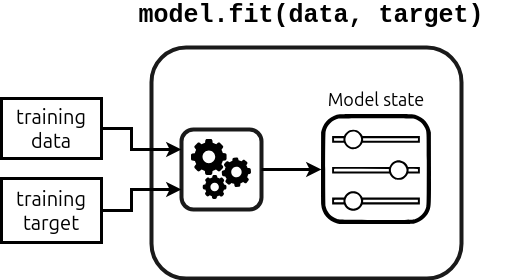
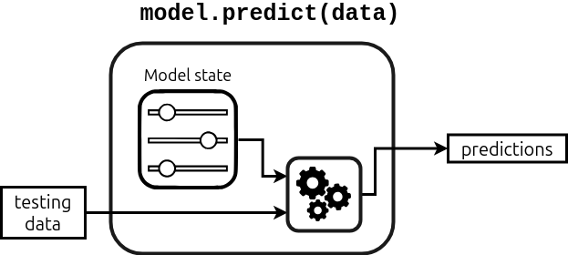
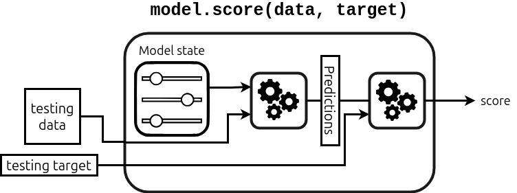

```python
import pandas as pd
import numpy as np
np.set_printoptions(legacy='1.25')
```


```python
import os 
os.getcwd()
```


    '/home/flavio/repositories/teaching/sicss-2025/teaching-notebooks/notebooks'


```python
adult_census = pd.read_csv("../datasets/adult-census-numeric.csv")
```


```python

```


```python
adult_census.head()
```


<div>
<style scoped>
    .dataframe tbody tr th:only-of-type {
        vertical-align: middle;
    }

    .dataframe tbody tr th {
        vertical-align: top;
    }

    .dataframe thead th {
        text-align: right;
    }
</style>
<table border="1" class="dataframe">
  <thead>
    <tr style="text-align: right;">
      <th></th>
      <th>age</th>
      <th>capital-gain</th>
      <th>capital-loss</th>
      <th>hours-per-week</th>
      <th>class</th>
    </tr>
  </thead>
  <tbody>
    <tr>
      <th>0</th>
      <td>41</td>
      <td>0</td>
      <td>0</td>
      <td>92</td>
      <td>&lt;=50K</td>
    </tr>
    <tr>
      <th>1</th>
      <td>48</td>
      <td>0</td>
      <td>0</td>
      <td>40</td>
      <td>&lt;=50K</td>
    </tr>
    <tr>
      <th>2</th>
      <td>60</td>
      <td>0</td>
      <td>0</td>
      <td>25</td>
      <td>&lt;=50K</td>
    </tr>
    <tr>
      <th>3</th>
      <td>37</td>
      <td>0</td>
      <td>0</td>
      <td>45</td>
      <td>&lt;=50K</td>
    </tr>
    <tr>
      <th>4</th>
      <td>73</td>
      <td>3273</td>
      <td>0</td>
      <td>40</td>
      <td>&lt;=50K</td>
    </tr>
  </tbody>
</table>
</div>


This dataset has all we need
- the target class we want to predict: `class`
- the data we want to use to train the model: remaining columns

Let's now separate the predictors from the target

### Separate the data and the target


```python
target_name = "class"
target = adult_census[target_name]
target
```


    0         <=50K
    1         <=50K
    2         <=50K
    3         <=50K
    4         <=50K
              ...  
    39068     <=50K
    39069     <=50K
    39070      >50K
    39071     <=50K
    39072      >50K
    Name: class, Length: 39073, dtype: object


```python
data = adult_census.drop(columns=[target_name])
data.head()
```


<div>
<style scoped>
    .dataframe tbody tr th:only-of-type {
        vertical-align: middle;
    }

    .dataframe tbody tr th {
        vertical-align: top;
    }

    .dataframe thead th {
        text-align: right;
    }
</style>
<table border="1" class="dataframe">
  <thead>
    <tr style="text-align: right;">
      <th></th>
      <th>age</th>
      <th>capital-gain</th>
      <th>capital-loss</th>
      <th>hours-per-week</th>
    </tr>
  </thead>
  <tbody>
    <tr>
      <th>0</th>
      <td>41</td>
      <td>0</td>
      <td>0</td>
      <td>92</td>
    </tr>
    <tr>
      <th>1</th>
      <td>48</td>
      <td>0</td>
      <td>0</td>
      <td>40</td>
    </tr>
    <tr>
      <th>2</th>
      <td>60</td>
      <td>0</td>
      <td>0</td>
      <td>25</td>
    </tr>
    <tr>
      <th>3</th>
      <td>37</td>
      <td>0</td>
      <td>0</td>
      <td>45</td>
    </tr>
    <tr>
      <th>4</th>
      <td>73</td>
      <td>3273</td>
      <td>0</td>
      <td>40</td>
    </tr>
  </tbody>
</table>
</div>


Now, let's explore the predictors, or *features*, in some more detail.


```python
data.columns
```


    Index(['age', 'capital-gain', 'capital-loss', 'hours-per-week'], dtype='object')


```python
n_rows = data.shape[0]
n_cols = data.shape[1]
print(f"The dataset contains {n_rows} samples and {n_cols} features.")
```

    The dataset contains 39073 samples and 4 features.


### Fit a model and make predictions

**Note**
- we use k-nearest neighbors strategy. It works by taking `k` samples that are closest to the sample of interest. It makes the prediction based on the majority class of these samples
- The algorithm is rarely used in practice, but it is intuitive. This is why we use it here. Later, we introduce better models.


The `fit` method trains the model from the input (features) and the target data.


```python
from sklearn.neighbors import KNeighborsClassifier
model = KNeighborsClassifier()
_ = model.fit(data, target)
```

#### What is going on?

Here is a figure:


The `fit` method
- takes training data (features) and training target (separately)
- does some computation -> learning algorithm
- stores the fitted model in the model state
- the model state can be re-used later for prediction and transformations (we'll see)


#### Now, let's make some predictions


```python
target_predicted =model.predict(data)
```

#### What is going on?


- the model uses the `predict` prediction function combines the model state with some testing data to make new predictions.


**Conclusion**: scikit learn has a standard interface, and `fit` and `predict` are methods in many of the scikit classes.


```python
target_predicted[:5]
```


    array([' >50K', ' <=50K', ' <=50K', ' <=50K', ' <=50K'], dtype=object)


```python
# let's compare to the actual data
target[:5]
```


    0     <=50K
    1     <=50K
    2     <=50K
    3     <=50K
    4     <=50K
    Name: class, dtype: object


```python
# and more explicitly
target[:5] == target_predicted[:5]
```


    0    False
    1     True
    2     True
    3     True
    4     True
    Name: class, dtype: bool


```python
n_correct = (target[:5] == target_predicted[:5]).sum()
```


```python
print(f"Number of correct predictions: {n_correct} / 5")
```

    Number of correct predictions: 4 / 5


To get a more precise assessment, compute the average success rate


```python
(target == target_predicted).mean()
```


    0.8242776341719346


Therefore, the model makes a correct prediction for about 82 samples out of 100. How good is this? Can we trust it?

### Train-test data split
- when building a machine learning model, it is important that we check how well it performs on data it has not seen.
- in other words, generalization is more than memorization: a model may be able to perfectly memorize its training data, but this does not imply that it performs equally well on data it has not seen
- in general, it is harder to make prediction on never-seen data than it is on data seen before.

We can evaluate the model by keeping some of the data out of the training set, and then look at the predictions for these held-out data. -> "training data", "test data"

In the current example, we actually have some data that were left out from the original data set. Let's load them and check predictions.


```python
adult_census_test = pd.read_csv("../datasets/adult-census-numeric-test.csv")
```

separate again the input features from the target


```python
target_test = adult_census_test[target_name]
data_test = adult_census_test.drop(columns=[target_name])
```


```python
nrow_test, ncol_test = data_test.shape
print(f"The testing dataset contains {nrow_test} samples and {ncol_test} features.")
```

    The testing dataset contains 9769 samples and 4 features.


We can use the `score` method, which does the work of checking the predictions for us. 
Note that for different classifier, the performance metric may differ.


```python
accuracy = model.score(data_test, target_test)
model_name = model.__class__.__name__
print(f"The test accuracy using a {model_name} is {accuracy:.3f}")
```

    The test accuracy using a KNeighborsClassifier is 0.804


### Summarizing

The mechanism of the `score` method is illustrated here:



To compute the score:
1. the model computes predictions, using `predict` method
2. uses a scoring function to compare the true `y` and the predictions
3. returns the score

(**model** is the generic term used to refer to objects whose goodness of fit can be measures with the `score` method)


Above, we saw that the predictiosn on the test set are indeed a bit lower than on the training set (0.80 vs 0.82). It shows how important it is to evaluate a model on data it has not seen before. We will discuss this in more detail later.


# Exercise: adapt your own first model

The goal of this exercise is to fit a similar model as we just did to get familiar with manipulating scikit-learn objects and in particular the `.fit/.predict/.score` API.

Before we used `model = KNeighborsClassifier()`. All scikit-learn models can be created without arguments. This is convenient because it means that you don’t need to understand the full details of a model before starting to use it.

One of the KNeighborsClassifier parameters is n_neighbors. It controls the number of neighbors we are going to use to make a prediction for a new data point.

#### 1. What is the default value of the n_neighbors parameter? 
Hint: Look at the documentation on the scikit-learn website or directly access the description inside your notebook by running the following cell. This will open a pager pointing to the documentation.
```python
from sklearn.neighbors import KNeighborsClassifier

KNeighborsClassifier?
```

#### 2. Create a KNeighborsClassifier model with n_neighbors=50
a. Fit this model on the train data and target that we used before
b. Use your model to make predictions on the first 10 data points inside the data. Do they match the actual target values?
c. Compute the accuracy on the training data.
d. Now load the test data from "../datasets/adult-census-numeric-test.csv" and compute the accuracy on the test data.

#### 3. (Optional) Find the optimal n_neighbors
What is the optimal number of neighbors to fit a K-neighbors classifier on this dataset?


```python

```

## Solutions

### (1) Default value of n_neighbors


```python
from sklearn.neighbors import KNeighborsClassifier
KNeighborsClassifier?
```


    Init signature:
    KNeighborsClassifier(
        n_neighbors=5,
        *,
        weights='uniform',
        algorithm='auto',
        leaf_size=30,
        p=2,
        metric='minkowski',
        metric_params=None,
        n_jobs=None,
    )
    Docstring:     
    Classifier implementing the k-nearest neighbors vote.
    
    Read more in the :ref:`User Guide <classification>`.
    
    Parameters
    ----------
    n_neighbors : int, default=5
        Number of neighbors to use by default for :meth:`kneighbors` queries.
    
    weights : {'uniform', 'distance'}, callable or None, default='uniform'
        Weight function used in prediction.  Possible values:
    
        - 'uniform' : uniform weights.  All points in each neighborhood
          are weighted equally.
        - 'distance' : weight points by the inverse of their distance.
          in this case, closer neighbors of a query point will have a
          greater influence than neighbors which are further away.
        - [callable] : a user-defined function which accepts an
          array of distances, and returns an array of the same shape
          containing the weights.
    
        Refer to the example entitled
        :ref:`sphx_glr_auto_examples_neighbors_plot_classification.py`
        showing the impact of the `weights` parameter on the decision
        boundary.
    
    algorithm : {'auto', 'ball_tree', 'kd_tree', 'brute'}, default='auto'
        Algorithm used to compute the nearest neighbors:
    
        - 'ball_tree' will use :class:`BallTree`
        - 'kd_tree' will use :class:`KDTree`
        - 'brute' will use a brute-force search.
        - 'auto' will attempt to decide the most appropriate algorithm
          based on the values passed to :meth:`fit` method.
    
        Note: fitting on sparse input will override the setting of
        this parameter, using brute force.
    
    leaf_size : int, default=30
        Leaf size passed to BallTree or KDTree.  This can affect the
        speed of the construction and query, as well as the memory
        required to store the tree.  The optimal value depends on the
        nature of the problem.
    
    p : float, default=2
        Power parameter for the Minkowski metric. When p = 1, this is equivalent
        to using manhattan_distance (l1), and euclidean_distance (l2) for p = 2.
        For arbitrary p, minkowski_distance (l_p) is used. This parameter is expected
        to be positive.
    
    metric : str or callable, default='minkowski'
        Metric to use for distance computation. Default is "minkowski", which
        results in the standard Euclidean distance when p = 2. See the
        documentation of `scipy.spatial.distance
        <https://docs.scipy.org/doc/scipy/reference/spatial.distance.html>`_ and
        the metrics listed in
        :class:`~sklearn.metrics.pairwise.distance_metrics` for valid metric
        values.
    
        If metric is "precomputed", X is assumed to be a distance matrix and
        must be square during fit. X may be a :term:`sparse graph`, in which
        case only "nonzero" elements may be considered neighbors.
    
        If metric is a callable function, it takes two arrays representing 1D
        vectors as inputs and must return one value indicating the distance
        between those vectors. This works for Scipy's metrics, but is less
        efficient than passing the metric name as a string.
    
    metric_params : dict, default=None
        Additional keyword arguments for the metric function.
    
    n_jobs : int, default=None
        The number of parallel jobs to run for neighbors search.
        ``None`` means 1 unless in a :obj:`joblib.parallel_backend` context.
        ``-1`` means using all processors. See :term:`Glossary <n_jobs>`
        for more details.
        Doesn't affect :meth:`fit` method.
    
    Attributes
    ----------
    classes_ : array of shape (n_classes,)
        Class labels known to the classifier
    
    effective_metric_ : str or callble
        The distance metric used. It will be same as the `metric` parameter
        or a synonym of it, e.g. 'euclidean' if the `metric` parameter set to
        'minkowski' and `p` parameter set to 2.
    
    effective_metric_params_ : dict
        Additional keyword arguments for the metric function. For most metrics
        will be same with `metric_params` parameter, but may also contain the
        `p` parameter value if the `effective_metric_` attribute is set to
        'minkowski'.
    
    n_features_in_ : int
        Number of features seen during :term:`fit`.
    
        .. versionadded:: 0.24
    
    feature_names_in_ : ndarray of shape (`n_features_in_`,)
        Names of features seen during :term:`fit`. Defined only when `X`
        has feature names that are all strings.
    
        .. versionadded:: 1.0
    
    n_samples_fit_ : int
        Number of samples in the fitted data.
    
    outputs_2d_ : bool
        False when `y`'s shape is (n_samples, ) or (n_samples, 1) during fit
        otherwise True.
    
    See Also
    --------
    RadiusNeighborsClassifier: Classifier based on neighbors within a fixed radius.
    KNeighborsRegressor: Regression based on k-nearest neighbors.
    RadiusNeighborsRegressor: Regression based on neighbors within a fixed radius.
    NearestNeighbors: Unsupervised learner for implementing neighbor searches.
    
    Notes
    -----
    See :ref:`Nearest Neighbors <neighbors>` in the online documentation
    for a discussion of the choice of ``algorithm`` and ``leaf_size``.
    
    .. warning::
    
       Regarding the Nearest Neighbors algorithms, if it is found that two
       neighbors, neighbor `k+1` and `k`, have identical distances
       but different labels, the results will depend on the ordering of the
       training data.
    
    https://en.wikipedia.org/wiki/K-nearest_neighbor_algorithm
    
    Examples
    --------
    >>> X = [[0], [1], [2], [3]]
    >>> y = [0, 0, 1, 1]
    >>> from sklearn.neighbors import KNeighborsClassifier
    >>> neigh = KNeighborsClassifier(n_neighbors=3)
    >>> neigh.fit(X, y)
    KNeighborsClassifier(...)
    >>> print(neigh.predict([[1.1]]))
    [0]
    >>> print(neigh.predict_proba([[0.9]]))
    [[0.666 0.333]]
    File:           ~/repositories/teaching/sicss-2025/teaching-notebooks/ml_workshop/lib/python3.12/site-packages/sklearn/neighbors/_classification.py
    Type:           ABCMeta
    Subclasses:     


**Solution: 5**

### (2) Create KNeighborsClassifier with n_neighbors=50


```python
model = KNeighborsClassifier(n_neighbors=50)
```


```python
_ = model.fit(data, target)
```


```python
predictions_in = model.predict(data)
```


```python
predictions_in[:10] == target[:10]
```


    0     True
    1     True
    2     True
    3     True
    4     True
    5     True
    6     True
    7     True
    8     True
    9    False
    Name: class, dtype: bool


```python
accuracy_train = model.score(data, target)
print(f"Accuracy on training set: {accuracy_train:.3f}")
```

    Accuracy on training set: 0.829


```python
accuracy_test = model.score(data_test, target_test)
```


```python
print(f"Accuracy on test set: {accuracy_test:.3f}")
```

    Accuracy on test set: 0.818


```python

```

### Intuitions on linear models
https://esciencecenter-digital-skills.github.io/scikit-learn-mooc/linear_models/linear_models_slides.html

logistic regression
- line is a probability that y=1
- discuss confidence along the line
- linear model: internally it takes a linear combination of (input features * coefficients). *linear in parameters*, ie cannot have `a*b`
- the combination is then a probability between 0 and 1.

2-dim logistic regression:
- stronger lines -> probability closer to 0 or 1
- weaker lines -> probs closer to 0.5
- *linear* line -> linear separation boundary; in other words, takes linear combination of input features * parameters

multi-class prediction
- straight lines -> from linear model
- but why are there kinks?

linear models not suited to all data
- not always linearly separable in the input space
- if not: if we want to keep using a linear model, we need to find new features, and hope that the data become linearly separably in the new input space.
- example: completely new feature, or a transformation of the original features (square or similar) -> in 2d, the function may not appear linear anymore, but it's still a linear model. intuitively: (i) in higher-dimensional input space, it's still linear. (ii) linear in parameters.

take-home
- simple and fast baselines; easy to set up; easy to interpret
- can underfit -> feature engineering
- with a lot of features, linear models are hard to beat


```python

```


```python

```


```python

```
