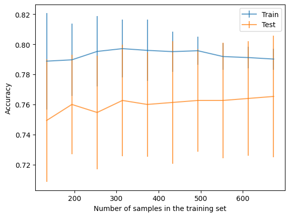

# Comparing train and test errors

https://esciencecenter-digital-skills.github.io/scikit-learn-mooc/overfit/learning_validation_curves_slides.html


## quantify trade-off between over- and underfitting by comparing train and test errors
- validation curves -> varying complexity
- learning curves -> varying sample size

train vs test error: increasing complexity
- degree 2 poly -> train and test error goes down. fits both sets fine
- degree 5 poly -> train error still decreases, but test error increases. memorizes noise (for instance at the very right of the figure)
- degree 9 poly -> memorization gets extreme

learning curvies: varying sample size
- fix parameters of the model, and vary the sample size
- degree 9 poly from before
- with small data set, big gap between train and test error
- with larger sample, teh function get smoother -- the noise is smoothed out
- if we have enough samples, train and test errors converge. in this case, this is the case because the degree 9 poly is the correct data generating process.
- in general, there are decreasing returns to sample size: irreducible error (holding N params fixed!!)

*complexity* is captured through different parameters in different families
- polynomial vs decision tree
- different "inductive bias": shape of the prediction function that one model favors vs another shape. example: tree is piecewise linear, polynomial is smoother (no kinks).
- for many families, we can go from complex to simpler variants. this is called regularization.

# Exercise: Validation and learning curves

#### Train and test SVM classifier (15 min,  2 people) 

The aim of this exercise is to:
* train and test a support vector machine classifier through cross-validation;
* study the effect of the parameter gamma (one of the parameters controlling under/over-fitting in SVM) using a validation curve;
* determine the usefulness of adding new samples in the dataset when building a classifier using a learning curve. 

We will use blood transfusion dataset located in `../datasets/blood_transfusion.csv`. First take a data exploration to get familiar with the data.

You can then start off by creating a predictive pipeline made of:

* a [`sklearn.preprocessing.StandardScaler`](https://scikit-learn.org/stable/modules/generated/sklearn.preprocessing.StandardScaler.html) with default parameter;
* a [`sklearn.svm.SVC`](https://scikit-learn.org/stable/modules/generated/sklearn.svm.SVC.html)

Script below will help you get started:

```python=
from sklearn.pipeline import make_pipeline
from sklearn.preprocessing import StandardScaler
from sklearn.svm import SVC

model = make_pipeline(StandardScaler(), SVC())
```

You can vary gamma between 10e-3 and 10e2 by generating samples on a logarithmic scale with the help of

```python=
gammas = np.logspace(-3, 2, num=30)
param_name = "svc__gamma"
```

To manipulate training size you could use:

```python=
train_sizes = np.linspace(0.1, 1, num=10)
```


## Solution

SVM is similar to logistic regression. Flexibilty increases in the kernal size that makes the model non-linear.


```python
import pandas as pd
import numpy as np
np.set_printoptions(legacy='1.25')

blood_transfusion = pd.read_csv("../datasets/blood_transfusion.csv")
data = blood_transfusion.drop(columns="Class")
target = blood_transfusion["Class"]
```


```python
from sklearn.pipeline import make_pipeline
from sklearn.preprocessing import StandardScaler
from sklearn.svm import SVC

model = make_pipeline(StandardScaler(), SVC())
```


```python
gammas = np.logspace(-3, 2, num=30)
param_name = "svc__gamma"
```


```python
train_sizes = np.linspace(0.1, 1, num=10)

```

Short look at the dataset - normally we should do this more systematically


```python
data.describe()
```


<div>
<style scoped>
    .dataframe tbody tr th:only-of-type {
        vertical-align: middle;
    }

    .dataframe tbody tr th {
        vertical-align: top;
    }

    .dataframe thead th {
        text-align: right;
    }
</style>
<table border="1" class="dataframe">
  <thead>
    <tr style="text-align: right;">
      <th></th>
      <th>Recency</th>
      <th>Frequency</th>
      <th>Monetary</th>
      <th>Time</th>
    </tr>
  </thead>
  <tbody>
    <tr>
      <th>count</th>
      <td>748.000000</td>
      <td>748.000000</td>
      <td>748.000000</td>
      <td>748.000000</td>
    </tr>
    <tr>
      <th>mean</th>
      <td>9.506684</td>
      <td>5.514706</td>
      <td>1378.676471</td>
      <td>34.282086</td>
    </tr>
    <tr>
      <th>std</th>
      <td>8.095396</td>
      <td>5.839307</td>
      <td>1459.826781</td>
      <td>24.376714</td>
    </tr>
    <tr>
      <th>min</th>
      <td>0.000000</td>
      <td>1.000000</td>
      <td>250.000000</td>
      <td>2.000000</td>
    </tr>
    <tr>
      <th>25%</th>
      <td>2.750000</td>
      <td>2.000000</td>
      <td>500.000000</td>
      <td>16.000000</td>
    </tr>
    <tr>
      <th>50%</th>
      <td>7.000000</td>
      <td>4.000000</td>
      <td>1000.000000</td>
      <td>28.000000</td>
    </tr>
    <tr>
      <th>75%</th>
      <td>14.000000</td>
      <td>7.000000</td>
      <td>1750.000000</td>
      <td>50.000000</td>
    </tr>
    <tr>
      <th>max</th>
      <td>74.000000</td>
      <td>50.000000</td>
      <td>12500.000000</td>
      <td>98.000000</td>
    </tr>
  </tbody>
</table>
</div>


```python
target.describe()
```


    count             748
    unique              2
    top       not donated
    freq              570
    Name: Class, dtype: object


### (1) simple training/evaluation run


```python
from sklearn.model_selection import cross_validate, ShuffleSplit

# use shuffle split for lower errors in the figures
cv = ShuffleSplit(random_state=0)
cv_result = cross_validate(model, data, target, cv=cv)
cv_result["test_score"].mean()
```


    0.7653333333333334


### (2) validation curve: effect of flexibility


```python
# solution
import numpy as np

from sklearn.model_selection import ValidationCurveDisplay

gammas = np.logspace(-3, 2, num=30)
param_name = "svc__gamma"
disp = ValidationCurveDisplay.from_estimator(
    model,
    data,
    target,
    param_name=param_name,
    param_range=gammas,
    cv=cv,
    scoring="accuracy",  # this is already the default for classifiers
    score_name="Accuracy",
    std_display_style="errorbar",
    errorbar_kw={"alpha": 0.7},  # transparency for better visualization
    n_jobs=2,
)

_ = disp.ax_.set(
    xlabel=r"Value of hyperparameter $\gamma$",
    title="Validation curve of support vector machine",
)
```


    

    


Results
- test accuracy starts decreasing aroudn $gamma>1$: overfitting
- before, no clearly "best" flexibility; test error flat


```python
# solution
from sklearn.model_selection import LearningCurveDisplay

LearningCurveDisplay.from_estimator(
    model,
    data,
    target,
    train_sizes=train_sizes,
    cv=cv,
    score_type="both",
    scoring="accuracy",  # this is already the default for classifiers
    score_name="Accuracy",
    std_display_style="errorbar",
    errorbar_kw={"alpha": 0.7},  # transparency for better visualization
    n_jobs=2,
)

_ = disp.ax_.set(title="Learning curve for support vector machine")
```


    

    


Results
- adding new samples does not improve training and testing scores
- why? features are useless, or we are using the wrong hyperparameters in the support vector machine


```python

```

### (3) training curve: effect of sample size


```python

```


### Quiz: over- and underfitting and learning curves (5 minutes, in pairs; if time-permitting) [Flavio]


**1. A model is overfitting when:**
- a) both the train and test errors are high
- b) train error is low but test error is high
- c) train error is high but the test error is low
- d) both train and test errors are low

*select a single answer*

**2. Assuming that we have a dataset with little noise, a model is underfitting when:**
- a) both the train and test errors are high
- b) train error is low but test error is high
- c) train error is high but the test error is low
- d) both train and test errors are low

*select a single answer*


**3. For a fixed training set, by sequentially adding parameters to give more flexibility to the model, we are more likely to observe:**
- a) a wider difference between train and test errors
- b) a reduction in the difference between train and test errors
- c) an increased or steady train error
- d) a decrease in the train error

*Select all answers that apply*

**4. For a fixed choice of model parameters, if we increase the number of labeled observations in the training set, are we more likely to observe:**
- a) a wider difference between train and test errors
- b) a reduction in the difference between train and test errors
- c) an increased or steady train error
- d) a decrease in the train error

*Select all answers that apply*

**5. Polynomial models with a high degree parameter:**
- a) always have the best test error (but can be slow to train)
- b) underfit more than linear regression models
- c) get lower training error than lower degree polynomial models
- d) are more likely to overfit than lower degree polynomial models

*Select all answers that apply*

**6. If we chose the parameters of a model to get the best overfitting/underfitting tradeoff, we will always get a zero test error.**
- a) True
- b) False

*Select a single answer*

